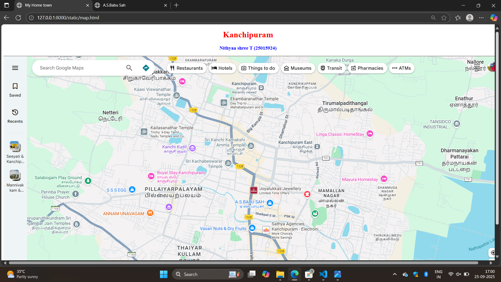
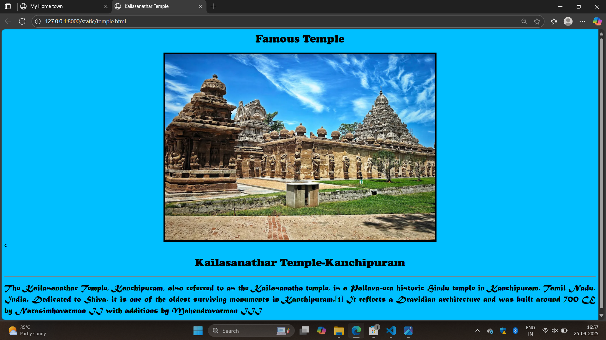
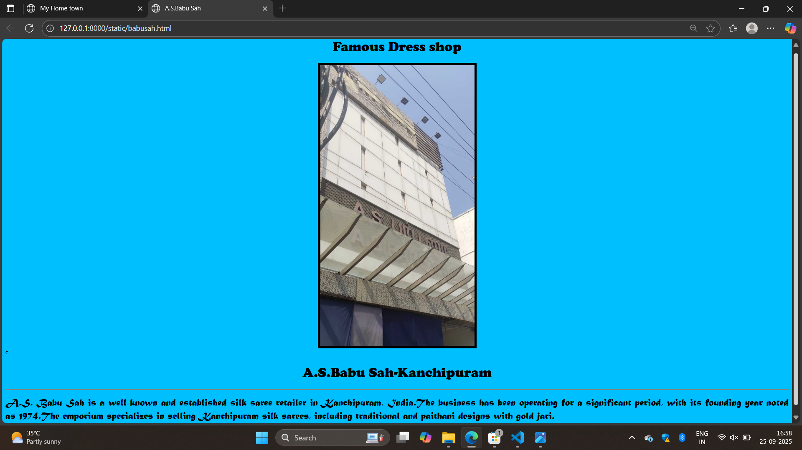

# Ex04 Places Around Me
## Date: 25-09-2025

## AIM
To develop a website to display details about the places around my house.

## DESIGN STEPS

### STEP 1
Create a Django admin interface.

### STEP 2
Download your city map from Google.

### STEP 3
Using ```<map>``` tag name the map.

### STEP 4
Create clickable regions in the image using ```<area>``` tag.

### STEP 5
Write HTML programs for all the regions identified.

### STEP 6
Execute the programs and publish them.

## CODE
~~~
map.html
<!DOCTYPE html>
<html>
<head>
<title>My Home town</title>
</head>
<body>
<h1 align="center">
<font color="red"><b>Kanchipuram</b></font>
</h1>
<h3 align="center">
   <font color="blue"><b>Nithyaa shree T (25015924)</b></font>
</h3>
<center>
    
    <map name="#My Home town">
        <area target="_blank" alt="Kailasanathar Temple" title="Kailasanathar Temple" href="temple.html" coords="493,256,740,324" shape="rect">
        <area target="_blank" alt="A.S.BABU SAH" title="A.S.BABU SAH" href="babusah.html" coords="1057,592,849,536" shape="rect">
    </map>
</center>
</body>
</html>

temple.html
<html>
    <head>
    <title >Kailasanathar Temple</title>
    </head>
<body bgcolor= "DeepSkyBlue">
    <h1 align="center">
    <font   face="Cooper black" color="black"><b>Famous Temple</b></font>    
    </h1> 
    <center>    <image src="kailasanathar temple.png" align="center" border="5" ></image></center>
c
    <h3 align="center">
    <h1 align ="center"><font face="Cooper black" color="black"><b>Kailasanathar Temple-Kanchipuram</b></font> </h1>   
    <hr size="3" color="grey">
    <p align="justify">
    <font face="Matura MT Script Capitals Regular" size="5" color="black">
    The Kailasanathar Temple, Kanchipuram, also referred to as the Kailasanatha temple, is a Pallava-era historic Hindu temple in Kanchipuram, Tamil Nadu, India. Dedicated to Shiva, it is one of the oldest surviving monuments in Kanchipuram.[1] It reflects a Dravidian architecture and was built around 700 CE by Narasimhavarman II with additions by Mahendravarman III</body>
</html>

babusah.html

<html>
    <head>
    <title >A.S.Babu Sah</title>
    </head>
<body bgcolor= "DeepSkyBlue">
    <h1 align="center">
    <font   face="Cooper black" color="black"><b>Famous Dress shop</b></font>    
    </h1> 
    <center>    <image src="A.S.Babu sah.png" align="center" border="5" ></image></center>
c
    <h3 align="center">
    <h1 align ="center"><font face="Cooper black" color="black"><b>A.S.Babu Sah-Kanchipuram</b></font> </h1>   
    <hr size="3" color="grey">
    <p align="justify">
    <font face="Matura MT Script Capitals Regular" size="5" color="black">
    A.S. Babu Sah is a well-known and established silk saree retailer in Kanchipuram, India.The business has been operating for a significant period, with its founding year noted as 1974.The emporium specializes in selling Kanchipuram silk sarees, including traditional and paithani designs with gold jari.</body>
</html>
~~~

## OUTPUT





## RESULT
The program for implementing image maps using HTML is executed successfully.
